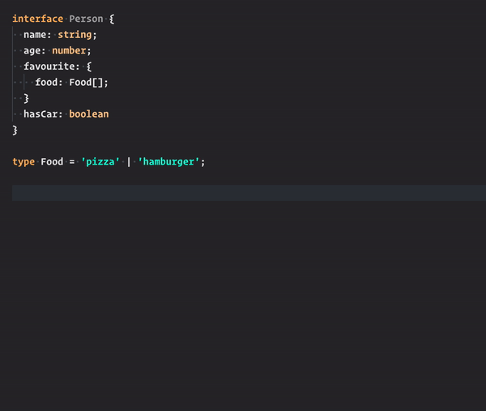

# Filterer

Type-safe way to create filters list by assigning value to draft object. Generated list can be later converted to things like SQL queries or Firebase Queries etc.

My goal was to create some way of type-safe 'declaring' what I'm looking for and recording my 'expectations' so I can use them later in any way.

Note: This is not alternative to `array.filter` - array filter is cool, but you cannot serialize array.filter function. This is a bit different from `array.filer` as you do `person.name = 'Bob'` instead of `return person.name === 'Bob'`, but again - this way it's possible to 'record' your filter and serialize it.

Note this is proof of concept. I want to create concept of 'adapters' later on so this function could output working SQL queries (with joins info) etc out of the box.



```ts
interface Person {
  name: string;
  age: number;
  favourite: {
    food: Food[];
  };
  hasCar: boolean;
}

type Food = 'pizza' | 'hamburger';

const filters = createFilters<Person>((person) => {
  person.name = 'Bob';
  person.age = ['>', 20];
  person.favourite.food = ['includes', 'pizza'];
  person.hasCar = true;
});

console.log(filters);
// [
//   {
//     path: ['name'],
//     value: 'Bob'
//   },
//   {
//     path: ['age'],
//     value: ['>', 20]
//   },
//   {
//     path: ['favourite', 'food'],
//     value: ['includes', 'pizza']
//   },
//   {
//     path: ['hasCar'],
//     value: true
//   }
// ]
```

`yarn add filterer`

## Licence

MIT
